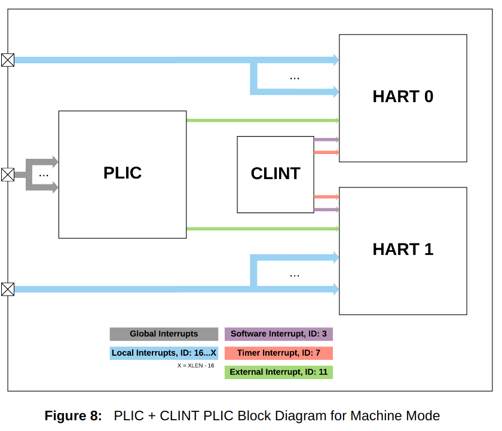
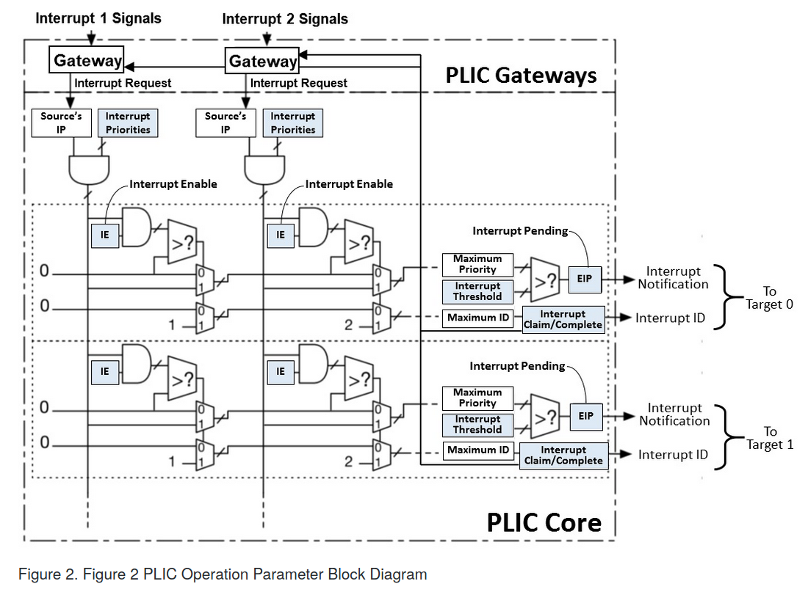

# RISC-V 中断

最近又从各种地方找了一点相关的资料来看，感觉比以前了解的更多了，在这里整理一下。

## 中断/异常/ Trap 概念澄清

* 从产生原因来对中断/异常进行区分

  * 中断是指在指令流正常执行过程中突然被别的请求打断，需要去进行处理之后，再继续执行接下来的指令
  * 异常是指一条指令的执行出了问题，需要停下来进行相应的处理，如果可恢复的话能够回来继续执行接下来的指令

* 然而，从处理器的视角来看，中断和异常都是在一条指令执行之后，由于某些原因需要保存现场并去执行另一段代码，待执行完毕后（如果可恢复的话）再恢复现场执行接下来的指令。我们可以将两者统称为广义异常（Trap），并将它们重新按照同步/异步划分为两种 Trap。

* 同步 Trap 也就是 Trap 产生的原因与一条指令的执行有关，可能是因为指令执行出错，也可能是因为代码主动请求服务（如 ECALL 指令）。

  同步 Trap 又可分为精确和非精确。精确同步 Trap 也就是进入 Trap 恰好在出错或请求服务的指令执行完毕后，而非精确同步 Trap 进入 Trap 的位置可能与相关指令相差很远。

* 异步 Trap 也就是进入 Trap 的位置与指令的执行无关

* 现在我们明确给出了三者之间的概念。在中断和异常中，异常通常来源于 CPU 自身，而异常却往往来自于其他的外设，因此相对异常，它的机制更为复杂。

## 中断分类

* 从中断来源的角度，可以把中断分为时钟中断（Timer Interrupt）、软件中断（Software Interrupt）、外部中断（External Interrupt）。其中时钟中断和软件中断由 CLINT 分发给 hart，而外部中断主要由 PLIC 分发给 hart。下面的图片展示了整体架构：

  

## PLIC

由于 PLIC 仅负责外部中断的分发，因此本小节中所有的中断本质上都是指外部中断。

* 我们还是看 PLIC 的一张整体图：

  

### PLIC 中断分发及处理全过程

* 先过一遍中断源经过仲裁被分发到某个 hart 上，并最终完成处理的全过程

  1. 中断信号首先查看中断源入口出的闸口（Gateway），如果没有被阻塞，就将该中断源的等待寄存器 IP (Interrupt Pending) 置为 1，并将该闸口阻塞，屏蔽该中断源后续过来的中断；

  2. 该中断信号与其他中断源过来的中断信号一起参与仲裁，对于一个中断目标而言，PLIC 要从这些中断信号中选出唯一一个分发到这个中断目标上。

     首先，中断信号要想参加某个中断目标的仲裁，需要满足几个条件，才能获得准入资格：

     * 该中断信号所属中断源对该中断目标的使能寄存器 IE (Interrupt Enable) 必须为 1；
     * 该中断信号所属中断源的优先级必须大于 0；
     * 该中断信号必须通过闸口过来，因此所属的中断源等待寄存器 IP 必须为 1。

     而 PLIC 按照从若干个满足准入资格的中断信号中选出一个中断源优先级最高的作为备选。若有多个中断源优先级相同的，则选择一个中断源 ID 最小的。

  3. PLIC 查看该中断目标上所设置的优先级阈值（Threshold），如果备选的中断信号所属中断源的优先级高于该阈值，则通知该中断目标。那么应该如何通知呢？

     这里需要知道，每个 hart 都可能有 M/S/U Mode External Interrupt 三种中的若干种目标。例如，比如中断目标为 hart0 上的 S Mode External Interrupt，则 hart0 上的 `sip.seip` 会被置 1。

  4. 中断目标接到中断通知后，如果决定响应中断，软件需要读取 PLIC 上该中断目标对应的响应/完成寄存器得到被选中的那个中断源的编号，自此可以进入该中断源对应的中断服务例程进行处理；而 PLIC 感应到 CPU 对该寄存器的 read 操作，它会将中断源对应的等待寄存器 IP 置 0。

  5. 在中断服务例程结束后，软件需要将之前读到的那个中断源 ID 再写入 PLIC 上当前中断目标对应的响应/完成寄存器。PLIC 感应到该 write 操作就知道中断目标已经完成了中断处理，随即会将 PLIC 上那个中断源对应的闸口打开，使得该中断源后续的中断信号可以进来。

### PLIC 相关寄存器

* 每个中断源的等待寄存器 IP，只读
* 每个中断源的优先级，可读可写
* 每对(中断源，中断目标)的使能寄存器 IE，可读可写
* 每个中断目标的优先级阈值，可读可写
* 每个中断目标的响应/完成寄存器，可读可写

### 软件接口分析

* 姑且可以理解成输入端是各中断源传过来的 1 比特信号，然后输出端直接连到各个 hart 的 

## CLINT

### 时钟中断

### 软件中断

## RISC-V 相关 CSR

## RISC-V 中断相关机制 on hart

在一个 hart 接到 interrupt notification 之后，也就是检测到某个 Interrupt Pending Bit 被置 1：
1. 决定是否处理中断
* 假设 hart 当前特权级为 x，接收到的中断特权级为 y，中断类型不妨设为外部中断 EI（可替换为 SI/TI），则
	* 如果 y <= x 时，能看到 xip.yeip 被置 1，此时查看 xstatus.xie 和 xie.yeie 是否均置 1，如果是的话处理中断；否则会被屏蔽
	* 如果 y > x 时，无条件处理中断 
2. 决定由哪个态来处理中断
* 目前仅支持 M-Trap, S-Trap，因此对于要处理的中断：
	* 如果是 M 态中断，则只能 trap 进 M 态进行处理；
	* 否则(S/U 态中断)，如果 mideleg 对应的位为 1，则在 S 态上处理，不然在 M 态上处理。

## 思考

本来之前在 Qemu 上的逻辑是：通过 delegation，我们将本来在 M 态处理的串口中断代理到 S 态处理，从规范上看到的说法，也就是设置 `scause,stval,sepc` 的值，然后应该是跳转到 `stvec` 指定的位置，跟之前所想不同的是硬件自动设置 `mstatus` 的 `spp,sie,spie` 标志位，而不是 `sstatus` 寄存器的。那样，由于 `stvec` 指向的肯定是 S 态中断处理，在返回的时候通过 SRET 指令返回，它会按照 `sstatus` 上的值进行返回，会出问题啊。

在 K210 移植时，已知不存在任何代理。问题在于，我们无法在 S 态接到串口中断，...

我们可以在软件上修改 `xstatus.xpp` 随后 XRET 来进入更低的优先级！这是我之前一直忘记的... 

要考虑的事情是，假如 hart 目前处于 M/S/U 态，这时在 PLIC 上任意一个与该 hart 相关的目标 M/S/U External Interrupt 进来了信号（当然，同时也可能从 CLINT 上进来软件/时钟中断的信号），那么该 hart 会如何处理？

## K210 S 态串口中断探索

首先，确认到通过 `sbi::console_getchar` 轮询输出字符是可行的。

接下来，首先看能不能触发到 M 态中断。

直接在 OpenSBI 打开串口的接受端中断使能，但是并没有触发 OpenSBI 中的 `unhandled external interrupt`。这大概是个什么情况呢...?

在考虑屏蔽之前，首先把 PLIC 上 uart 中断到 hart0 各特权级的外部中断的 IE 寄存器给打开。然后再试一试。目前 M/S EI 到 uart1/2/3 的 IE 全都打开了，也还是进不到中断...

魔改了一下 OpenSBI 中的 `sbi_hart.c`，把 `mstatus.mie` 以及 `mie.meie` 都在启动的时候打开了。现在终于能在 M 态收到中断了...