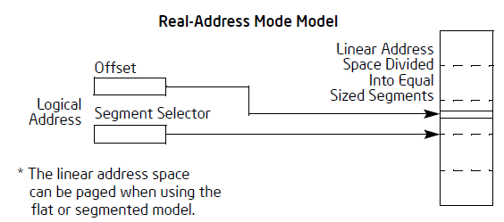

* 这里描述的处理器执行环境包括内存（地址空间）、通用寄存器、段寄存器、标志寄存器还有指令指针。
* Intel64架构为处理器新增了一个IA-32e的运行模式，使得一个64位的OS既可以通过兼容模式不加修改的运行32位的应用程序，又可以正常运行64位应用程序。在x86_64中我们只关心后一种64位模式。
* 64位模式将通用寄存器拓展到16个，每个位宽为64位。

## 基本执行环境总览

首先来看IA-32架构的基本执行环境。它包括32位线性地址和最多36位物理地址。8个通用寄存器，6个段寄存器，EFLAGS标志寄存器，指令指针寄存器EIP。指令则可以进行整数运算、控制流、操作比特和字符串、访存。8个x87 FPU浮点寄存器进行浮点运算。8个MMX寄存器（64bits packed），8个XMM寄存器和一个MXCSR寄存器（128bits packed），以及YMM寄存器（256bits packed）进行SIMD操作。BND0~BND3（每个位宽128位）以及BNDCFGU还有BNDSTATUS用于MPX相关指令。另外很重要的就是**栈**来支持函数调用。

在系统编程中还会用到一些其他资源。这里先列出一些比较感兴趣的。比如I/O端口，控制寄存器CR0~CR4，内存管理寄存器GDTR/IDTR/task register/LDTR。

在64位模式下与IA-32有一些不同。支持64位线性地址和最高52位物理地址。16个位宽为64位的通用寄存器，6个位宽为16位的段寄存器保持不变，指令指针位宽为64位，EFLAGS拓展为64位并可以通过RFLAGS来访问，但是*其高32位目前保留，低32位与EFLAGS相同*。栈指针位宽变为64位。全局描述符表寄存器GDTR和中断描述符表寄存器IDTR拓展到10字节从而可以保存完整的64位基址。局部描述符表寄存器LDTR和任务寄存器TR也同样进行了拓展。

## 内存管理

首先依然介绍IA-32的内存管理。IA-32有三种内存模型：第一种是flat模型，也就是一个32位的线性地址空间，使用被称为线性地址的32位字节地址来访问；第二种是分段内存管理，使用段选择子:段内偏移的逻辑地址来访问，在IA-32中最多有16383个不同的段，每个段大小为2^32字节；第三种是实模式，也是8086处理器的内存模型，用来兼容8086处理器上的应用。下面是实模式的图示：

在flat模式和分段管理模式下，如果启用页表机制，则线性地址通过页表映射为物理地址；否则直接将线性地址视为物理地址来访存。页表机制对应用程序是透明的，应用程序只能看到一个线性地址空间。

当CPU运行在不同模式下，能够使用的内存模型种类是不同的。目前我们只关注64位模式，在该模式下可以看成一个64位线性地址空间，CS/DS/ES/SS中的段基址均为0，同时分段内存管理和实模式内存模型不可用。

IA-32架构处理器在保护模式下可以设置为32位模式和16位模式，线性地址、逻辑地址和指令操作数的位宽均有所不同。在32位模式下，逻辑地址为一个16位的段选择子加上32位的段内偏移；在16位模式下，逻辑地址为一个16位的段选择子加上一个16位的段内偏移。指令前缀（Instruction prefixes）可以在一个程序中暂时重载默认的地址和操作数的位宽，这是由当前代码段的段描述符决定的。在实模式下，默认的地址和操作数的位宽均为16位，通过重载可以在实模式中启用32位寻址，但是32位线性地址空间中最大线性地址仍然为000FFFFFH。IA32的保护模式可以对物理地址位宽进行拓展，我们并不关心。

3.3.7小节提到了一些Intel64架构下64位模式下寻址的一些细节，过于琐碎先略过。

## 程序执行基本寄存器

在IA-32架构下有16个程序执行基本寄存器：8个通用寄存器，6个段寄存器（段选择子），EFLAGS（报告程序执行状态并能够在应用级别对处理器进行控制），指令指针EIP。其中段寄存器均16位，余下的均32位。

8个通用寄存器有EAX/EBX/ECX/EDX/ESI/EDI/ESP/EBP分别用于保存：

* 逻辑或算术指令的操作数
* 寻址的操作数
* 指针

注意ESP应该仅被用于栈指针。一些指令指定特定的寄存器保存操作数，如字符串指令中的ECX/ESI/EDI寄存器；另一些指令假定保存在某些寄存器中的指针与特定的段有关，如某些指令假定EBX寄存器中的指针指向DS段中的内存区域。

一些通用寄存器的特定用法总结如下：

* EAX累积操作数和结果数据
* EBX指向DS段中的数据
* ECX作为字符串和循环操作中的计数器
* EDX是I/O指针
* ESI指向DS段中的数据或作为字符串操作的源寄存器
* EDI指向ES段中的数据或作为字符串操作的目标寄存器
* ESP指向SS段中的栈指针
* EBP指向SS段中的数据

这些寄存器的低16位可以分别用AX/BX/CX/DX/SI/DI/SP/BP来访问。

AX/BX/CX/DX的高低8位可以单独访问，如AH访问AX的高8位，AL访问AX的低8位。

在64位模式下，有16个通用寄存器，默认的操作数位宽为32位（不过在MOV指令中疑似可以达到64位）。实际上通用寄存器既可以操作32位操作数，又可以操作64位操作数。在使用32位操作数的时候，相关的通用寄存器为EAX/EBX/ECX/EDX/ESI/EDI/ESP/EBP/R8D~R15D。在使用64位操作数的时候，相同通用寄存器位RAX/RBX/RCX/RDX/RSI/RDI/RSP/RBP/R8~R15。所有的寄存器都可以访问局部的byte(8bits)/word(16bits)/dword(32bits)/qword(64bits)，可能需要加上不同的REX前缀。

在访问byte registers有一些奇怪的限制，但是在64位模式下只使用带有REX前缀的通用寄存器应该就可以了。而且应该很少会遇到访问byte registers的情况。

暂时不考虑兼容模式。

在64位模式下，操作数的位宽会决定目标通用寄存器的结果中哪些位是有意义的。如果是64位，直接生成一个64位结果；如果是32位，生成一个32位结果并零拓展；如果是8或16位，会生成8/16位的结果，目标寄存器只有后8/16位会被覆盖。一个例外是，如果8/16位操作的结果用于64位地址计算，则会符号拓展到64位。

接下来是6个段寄存器，CS/DS/SS/ES/FS/GS每个里面保存一个16位的段选择子。