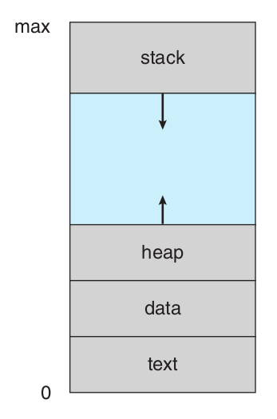
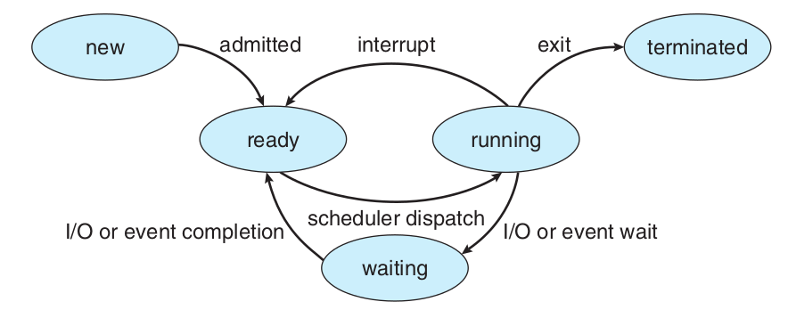

# Log

## 2020-06-25

感觉第三、四、五章绕不过去的，还是要看一下（希望能稍微看的快一点），也是尝试修改一下之前错误的观点。

当然关于同步互斥的大头集中在第六、七、八章。

做了个目录，看不下去了...

开始看 Zircon？

# Chapter1 绪论

## 1.2 计算机系统组成

* 每个设备的设备控制器管理若干设备寄存器以及一个内存缓冲区，他负责在设备和内存缓冲区之间进行数据交换
* OS 对于每个设备控制器都提供一个驱动程序，它将设备控制器所提供的接口封装成一个便于 OS 其他模块更易于访问该设备的接口
* CPU 和 设备控制器可以并行工作，并竞争使用内存；内存控制器负责在其中进行协调

### 1.2.1 中断

* 典型场景：一个程序发起一次 I/O 请求
  * 首先，设备驱动对设备控制器中的设备寄存器进行适当的修改，设备控制器检查设备寄存器确定所请求的操作
  * 然后，设备控制器开始在设备和内存缓冲区之间进行数据交换
  * 一旦数据交换结束，设备控制器会通知设备驱动操作已经完成
  * 最后，设备驱动将控制权移交给 OS 的其他模块，可能将读到的数据返回回去
* 那么，设备控制器应如何通知设备驱动“操作已经完成”呢？

#### 1.2.1.1 中断概述

* 硬件在总线上向 CPU 发送一个信号来触发中断，随后 CPU 会跳转到中断服务例程，它按照中断类型分发到具体的中断处理，待处理结束后，再跳转回被中断的位置

  由于中断触发非常频繁，需要尽可能提升中断处理的速度，因此直接给出每个特定中断服务例程的函数指针来代替分发过程（*PS: 事实上在 rCore 中就是分发的:cry:*） ，也就是根据**中断号**在**中断向量表**中查表

* 中断前后的上下文保存与恢复

#### 1.2.1.2 中断的实现

* CPU 中有一根叫做 interrupt-request line 的线，CPU 每执行完一条指令之后都会在这根线上看看是否存在中断，如果有的话触发中断

* 整个流程如下：

  * 设备控制器通过向 interrupt-request line 发信号来产生（raise）中断
  * CPU 捕获（catch）中断并将其分发（dispatch）到合适的中断服务例程
  * 在中断服务例程中，清理（clear）该设备产生的中断

* 最基本的中断机制仅仅意味着使 CPU 有能力对像是设备控制器准备好工作的这类异步事件进行响应，但实际上，在现代操作系统中，我们需要更加复杂的中断特性

  1. 在关键的处理过程中将某些中断延迟处理的能力
  2. 将一个设备产生的中断高效的分发到合适的 handler
  3. 多级中断，这样 OS 就可以区分高优先级和低优先级中断，并以不同的方式处理

  在现代 OS 中，这些特性是由 CPU 和硬件中断控制器来提供的。

  大多数 CPU 都有两根中断请求线，其中一个是不可屏蔽（nonmaskable）中断，用来处理那些不可恢复的错误（*PS: 感觉对应异常？*）；另一个是可屏蔽的（maskable），这根线可以被 CPU 暂时在不允许中断的关键处理过程中禁用，通常用于设备控制器请求与 CPU 进行交互

* 实际应用中，各种设备不同的 handler 总数要多于可用的中断号的数量，一种常见的解决方式叫做**链式中断**，也即中断向量表中的每个元素对应一个 handler 链表。每个中断请求都要在对应的链表中遍历直到找到合适的 handler。

  这种设计是两种方法中的一种权衡。

* 在 Intel 的设计中，中断号为 $0\sim 255$，其中 $0\sim 31$ 为 nonmaskable，其余为 maskable，主要用来处理设备中断。

* 中断机制还实现了中断优先级系统，它允许 CPU 在不必屏蔽所有中断的情况下延迟某些低优先级中断的处理，并且使得高优先级中断抢占低优先级中断的能力。

### 1.2.2 存储结构

* 我们可以将整个存储结构简单的分成两种：
  * 一是易失性的，也即断电时候会丢失上面的数据的存储。通常指的是 RAM 形式的内存或者寄存器；
  * 二是非易失性的，断电之后不会丢失上面的数据。他们又可以分为两种：
    * 机械的，如硬盘 HDD、光盘、磁带等；
    * 电子的，如闪存、SSD等。

### 1.2.3 I/O 架构

* 这里想比之前强调了 DMA 的重要性，也即不需要 CPU 的参与就能在主存和设备之间搬运大量数据，且仅在整个过程结束后产生一个中断。
* 此外还提到一些高端的架构中，系统中不同的组件可以并行的与其他组件进行通信，而不需要竞争总线的时钟周期。在这种情况下 DMA 的性能就会更高。

## 1.3 计算机系统结构

从处理器数量的角度进行分类...

### 1.3.1 单处理机

* 单核 + 很多只能执行有限任务的协处理器（例如磁盘控制器等，可以在上面跑一些算法），但总归也算是单核

### 1.3.2 多处理机

* *multiprocessor*：多个处理器（Processor），每个处理器含有一个单核 CPU，它们共享总线，有时还共享时钟、内存、外设

* 多核可以合作提高吞吐量，但由于须要同步互斥，运行速度并不能得到 $N$ 倍的提升

* 最常见的多核系统基于 SMP，每个核有着独立的寄存器，但共享内存、总线

  $N$ 个进程可以在 $N$ 个核上无任何性能损失的运行

  但若不是如此，进程调度如何保证负载均衡就成了一个问题

* 事实上，目前 *multicore* 也被引申成和 *multiprocessor* 同一含义，但是它们存在着不同：*multicore* 是单个 Processor 上含有多个 Core，它们在片上通信（on-chip），而 *multiprocessor* 各个 Core 需要通过总线通信，性能较低，能耗也较高
* 在 *multicore* 的设计中，通常既存在 local cache，也存在 shared cache，如两个 Core 各自有独立的 L1 Cache，但共享 L2 Cache

> 明确概念：
>
> *CPU*: 指的是执行指令的硬件；
>
> *Processor*: 一枚包含一个或者多个 CPU 的物理芯片；
>
> *Core*: CPU 的基本计算单元；
>
> *Multicore*: 在单个 CPU 上有着多个 Core；
>
> *Multiprocess*: 系统架构中含有多个 *Processor*

* 后面的 NUMA 不太想看，感觉没啥用

## 1.5 资源管理

### 1.5.5 缓存管理

* 缓存管理：如何选择合适的缓存容量以及替换算法

* 数据在各级存储以及之间的缓存中移动的过程可能由 OS 控制，也可能是硬件功能

* 一个数据可能同时出现在不同级的存储（包括缓存）上，在修改的过程中可能不一致，只有当完全写回之后才能保证内容的一致性

  在 *multitasking/multicore* 场景下尤其需要考虑缓存一致性（cache coherency），通常在硬件层面上解决，但是 OS 需要对它进行控制与配置才能达到的更高的性能

### 1.5.6 I/O 子系统管理

* 隐藏 I/O 设备的细节也是 OS 需要提供的功能之一，在 Unix 上，这一功能由 I/O 子系统提供，I/O 子系统包含如下子模块：
  * 包含缓冲、缓存、以及通过 MMIO 与设备进行交互（如 *Spooling* 表示将任务通过 MMIO 放到与设备约定的一块缓冲中）的内存管理功能
  * 一个通用的设备驱动接口
  * 为特定设备开发的驱动程序
* 只有为设备特别编写的驱动能够理解设备提供的接口并与之正确交互，最终应该需要将其转化为设备驱动的通用接口
* 具体内容参考第 12 章

# Chapter3 进程

* 过去，计算机只允许同时运行一个程序，它完全控制计算机的各种资源；但是现在的计算机允许多个程序并发执行，需要更精细的控制，因此抽象出了“执行中的程序”——也就是进程的概念，它是现代计算机系统中的工作单位
* 现代计算机系统含有一个进程集合，其中的某些在执行用户态代码，另外的一些在执行内核态代码，它们基于 CPU 复用技术并发执行

## 3.1 进程概念

* 前面区分了一下 *Job* 和 *Process* 的概念，但是目前不是很有用，就不细看了

### 3.1.1 进程

* 进程是正在执行的程序，他当前的状态可以用 PC 和 CPU 上各寄存器的值来表示

* 进程的地址空间分为以下几部分

  * 代码段：存放可执行代码
  * 数据段：存放全局变量
  * 堆段：管理程序运行期间动态分配的内存
  * 栈段：函数调用等过程中需要的临时存储

  如下图所示：

  
  
  值得注意的是，数据段和代码段的大小在执行过程中不会发生变化，但堆栈段的大小却会发生变化（分别对应调用/返回以及内存分配/回收）
  
  同时，这里也能找到 C 进程的内存布局
  
* 可执行文件的静态性与进程的动态性

* 一个进程可以作为其他程序的 runtime（如 JVM）

### 3.1.2 进程状态

* 经典的进程状态机

  

* 需要强调的是，同一时刻在一个核上只有运行一个进程，但就绪或者等待的进程可能有多个

### 3.1.3 PCB 进程控制块

进程控制块内应含有以下信息：

* 进程状态；
* PC；
* CPU 各寄存器的值用来从中断或进程切换回来后恢复现场；
* CPU 调度相关信息（包括进程优先级、指向调度队列的指针等）；
* 内存管理相关信息；
* 统计信息（总 CPU 使用、运行时间等等）；
* I/O 状态信息（分配给该进程的 I/O 设备列表，打开的文件列表等等）

### 3.1.4 线程

* 目前的进程模型默认进程只有单个执行流
* 简要介绍了一下多线程，但是具体内容要在第 4 章了

## 3.2 进程调度

* *multiprogramming*: 总是运行多个进程来最大化 CPU 使用率
* *time sharing*: 尽可能频繁的切换一个核上执行的任务，使得用户能与每个程序进行交互
* 为了达到上述目标，**进程调度器**可以从若干个可选进程中选出一个在核上执行
* 调度算法在 *multiprogramming* 和 *time sharing* 之间进行均衡需要将进程的行为纳入考量，可以大体上分成 I/O 密集型（花在 I/O 上的时间比花在 CPU 上的时间更多）以及 CPU 密集型（即很少发起 I/O 请求，大多数时间都在计算）

### 3.2.1 调度队列

* 分为就绪队列和等待队列，其中等待队列根据等待的条件不同又分成 I/O 等待队列/中断等待队列/子进程结束等待队列（创建子进程后立刻放进去），此外，当时间片用完之后，进程会被放回到就绪队列

### 3.2.2 CPU 调度

* CPU 调度器需要频繁的从就绪队列中选出一个进程来执行
* 可以通过**交换技术**将处于就绪或等待（？）状态中的进程暂时从内存换出到磁盘中，来尽可能减少对于内存的占用，具体的内容可以参考第 9 章

### 3.2.3 上下文切换

* 进程将目前的运行上下文保存在 PCB 中，并基于它进行保存/恢复
* 上下文切换的开销与处理器架构高度相关，某些处理器提供多组寄存器，此时上下文切换简单的修改当前寄存器组编号即可，当然这也只是当寄存器的组数不小于进程数才起作用
* 上下文切换所要保存的信息随着内核复杂程度的上升而增加

## 3.3 进程接口

## 3.4 进程间通信

## 3.5 内存共享系统上的 IPC

## 3.6 消息传递系统上的 IPC

## 3.7 IPC 系统举例

## 3.8 客户端-服务器通信架构

## 3.9 总结

# Chapter4 线程与并发

## 4.1 总览

* 线程包括一个线程 ID，一个 PC，一个寄存器集合，还有一个栈。它和其他跟它一样属于同一个进程的其他线程共享进程的代码段、数据段以及其他的 OS 资源，如打开的文件或信号等。

### 4.1.1 动机

* 多线程应用的场景比如开多个线程同时做不同的事情，或者是利用多核的能力进行高性能计算（将一些经典算法用多线程实现？）

* 实际上，单个应用可能会被要求做很多相似的任务，例如一个服务器需要同时处理上千个客户端的链接，如果一次只能处理一个客户端的请求的话，客户端的延迟会非常高

  一种方法是每接收一个客户端的连接，就新建一个进程进行处理；但是这样开销很大，因为这些进程都在做同样的事情，将新建一个进程改为新建一个线程将更高效

* 大多数内核也是多线程的。比如 Linux 在系统启动期间就会新建若干内核线程，每个线程执行一项特定的任务（如设备管理、内存管理、中断处理等等）。通过 `ps -ef` 可以查看当前正在运行的内核线程。其中内核线程 `kthreadd` 的 pid 为 2，它就是所有其他内核线程的父亲。

### 4.1.2 优点

多线程编程主要有以下四个优点：

1. 交互性

   对于 GUI 程序，耗时的计算可以放在后台线程上，不影响主线程的响应

2. 资源共享

   进程之间只能通过共享内存和进程间通信来共享资源，且它们必须由程序员显式配置；而线程之间天然的共享进程提供的地址空间和各种资源

3. 经济

4. 可拓展性

## 4.2 多核编程

## 4.3 多线程模型

## 4.4 线程库

## 4.5 隐式线程

## 4.6 线程隐患

## 4.7 例子

## 4.8 总结

# Chapter5 CPU 调度

## 5.1 基本概念

## 5.2 调度标准

## 5.3 调度算法

## 5.4 线程调度

## 5.5 多核调度

## 5.6 实时调度

## 5.7 例子

## 5.8 算法评估

## 5.9 总结

# Chapter6 同步互斥

## 6.1 背景

## 6.2 临界区问题

## 6.3 Peterson 算法

## 6.4 同步互斥的硬件支持

## 6.5 互斥锁

## 6.6 信号量

## 6.7 监视器

## 6.8 Liveness

## 6.9 评估

## 6.10 总结

# Chapter7 同步互斥的例子

## 7.1 经典同步互斥问题

## 7.2 内核内部的同步互斥

## 7.3 POSIX 同步互斥模型

## 7.4 Java 中的同步互斥

## 7.5 同步互斥的替代手段

## 7.6 总结

# Chapter8 死锁

## 8.1 系统模型

## 8.2 多线程应用中的死锁

## 8.3 死锁特点

## 8.4 处理死锁的办法

## 8.5 预防死锁

## 8.6 避免死锁

## 8.7 死锁检测

## 8.8 从死锁中恢复

## 8.9 总结

# Chapter12 I/O 子系统

