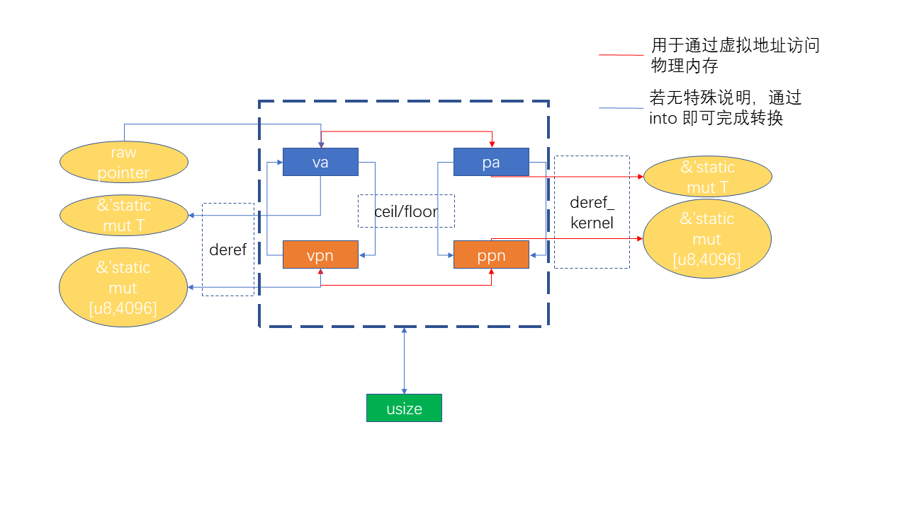

# lab3

* 首先是地址转换关系图：

  

  它里面涉及的 `VirtualAddress, VirtualPageNumber, PhysicalAddress, PhysicalPageNumber` 属于整体架构的最下层。 

* 页表层包括可以随处移动的 `PageTableEntry`（页表项标志位 `Flags` 也是在这里定义的） 以及用于解释一个物理页的页表项数组 `PageTable`。

  此外，页表 `PageTable` 所在的物理页帧由一个 `FrameTracker` 管理，而 `FrameTacker` 又由一个 `PageTableTracker` 管理。

* 映射层下面有若干个类：

  首先是 `Segment` 描述一段要以相同的方式和权限映射到物理内存的一段虚拟地址区间。`MapType` 也是在这里定义的。

  其次是 `Mapping` 负责管理一个三级页表，需要一个 `root_ppn`，还需要管理下面所有 `PageTracker` 的生命周期，那么又为何需要有一个 `mapped_pairs`？答案是 `PageTracker` 负责所有存放页表的物理页帧的生命周期，而 `mapped_pairs` 负责所有存放实际数据的物理页帧的生命周期。现在才回味过来，这确实是很棒的设计。
  
  最后是 `MemorySet` 表示一个访存空间（这个名字更好）。它主要是对 `Mapping` 进行进一步的封装，管理它的生命周期。同时还将访存空间中的 `Segment` 都存下来...
  
* 那么可否尝试画一张图呢？（画一张简单的图吧QAQ）

  ```mermaid
  flowchart TD;
  subgraph A [PageTable]
  PageTable;
  PageTableTracker;
  PageTableEntry;
  end
  subgraph B [Mapping]
  MemorySet;
  Mapping;
  Segment;
  end
subgraph C [Address]
  VA;
VPN;
  PA;
PPN;
  end
subgraph D [FrameAllocator]
  FrameTracker;
  end
  PageTableTracker == deref ==> PageTable;
  PageTable --> PageTableEntry;
  PageTableTracker --> FrameTracker;
  Mapping --> PageTableTracker;
  Mapping --> FrameTracker;
  MemorySet --> Mapping;
  MemorySet --> Segment;
  A --> C;
  B --> C;
  D --> C;
  ```
  
* 看起来不错，有那个感觉了。那么接下来看一下虚存。

* 在 `fs/swap.rs` 里面搞了一个 `Swap` 类型，内含一个 Inode 还有一个 FrameAllocator，在 `lazy_static` 中初始化全局实例 `SWAP`。通过 `Swap::alloc/dealloc` 可以以文件 `SWAP_FILE` 的相对页编号为单位对外存页进行分配、回收，`Swap::write/read_page` 可以对于给定的相对页编号对应的外存页进行 I/O。

* 类比 `FrameTracker`，有一个 `SwapTracker` 提供了外存页方便的访问接口，并可以在生命周期结束后将对应的外存页回收。

* 重新自底向上看一下各个类都有了哪些变化。

* 在 `Mapping` 里面开始有变化：新增了 `SwapperImpl` 并将原来的存储数据用的 `FrameTracker` 换成 `SwapTracker`。

  那么 `SwapperImpl` 是什么东西呢？

  有一个 `Swapper` 接口：这里负责管理所有尚在内存中的数据页，也就是原先的 `Mapping` 里面那些 `FrameTracker` 都交给 `Swapper` 管理了。它要设置一个允许同时在内存中驻留的物理页帧的限额（Quota），并可以通过 `push/pop` 来插入/删除 `(VPN, FrameTracker)` 映射。同时支持 `retain` 功能。真正使用的就是 `FIFOSwapper`。

  所以 `Mapping` 就很好理解：它的 `Swapper` 用来管理尚在内存中的数据页，`(VPN, SwapTracker)` 管理被换出的外存页，存储页表的所有页面还是在内存中，我们仍可以用 `PageTableTracker` 来跟踪。

  `Mapping` 的核心方法 `map`，也即对一个 `Segment` 进行映射，可以向其中写入数据。在处理 `Framed` 方式的的时候，我们要分配一个物理页帧用于存放数据。那么我们要先看看 `Swapper` 里面是否还允许在内存中同时驻留更多的物理页帧，若可以的话，我们就分配一个物理页帧并记录在 `Swapper` 中；否则我们要从 `Swapper` 中换出一个物理页帧，将对应的页表项进行修改（因为实际上我们可以同时知道物理页帧和虚拟地址，由此可以找到页表项），猜测应该是将 V 标志位 clear，然后分配一个外存页，将原有的数据从将被换出的物理页帧复制到外存页，在页表项的 PPN 中应该记录外存页的编号。(VPN，外存页编号)的 pair 应当在 `Mapping` 中被记录。如此就准备好了一个空的物理页帧，新的虚拟页可以映射过去，并将数据复制过去。更简洁的说，在这种情况下，`Swapper` 的一个 `(vpn_old, ppn)` 将变成 `(vpn_new, ppn)`，同时 `swapped_pages` 新增一个 `(vpn_old, new_allocated_disk_sector)`。以上是我设想中的实现。

  实际上的话，当 `Swapper` 已满的时候，`map` 只是会分配一个外存页，将数据写过去，并将(VPN，外存页编号)保存到 `swapped_pages` 中。可能是出于页表项 PPN 字段意义的一致性，并不会将外存页编号写进去。这个过程实际上是在缺页异常中进行的。只不过就不用分配外存页了，因为它已经好好地记录在 `swapped_pages` 里面了。

* 对于 `MemorySet` 而言，`Mapping` 的各个接口就已经是透明的了，故而上面无需再进行任何改动。 
  
  
  
  
  
  